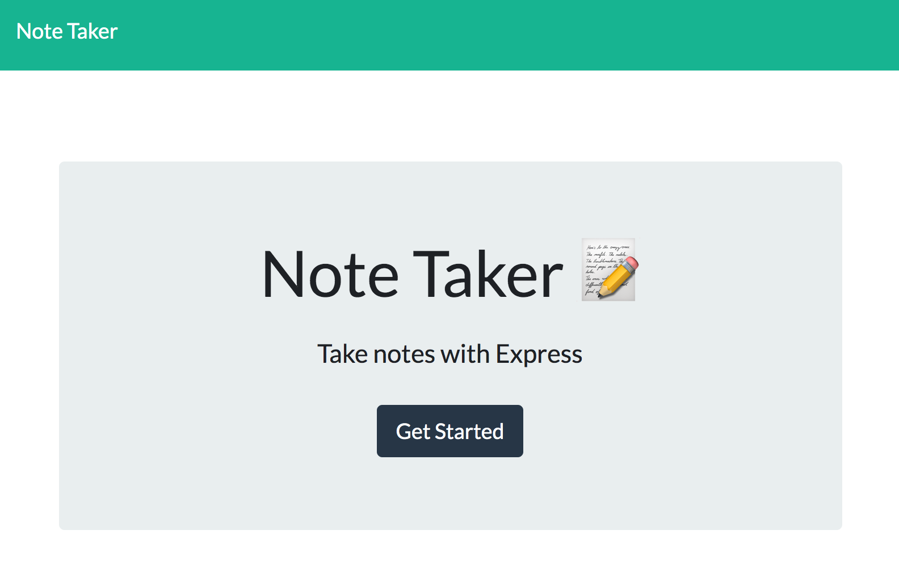

# 11-Express-Note-Taker

    `This is a Note Taker application that can be used to write and save notes. The application will use an Express.js back end and will save and retrieve note data from a JSON file.`

## Functionality/Requirments

* Opening Note taker will present a landing page with a link to a notes page

* Clicking the link to the notes page will present you with a page with existing notes listed in the left-hand column, plus empty fields to enter a new note title and the note’s text in the right-hand column

* A Save icon appears in the navigation at the top of the page when entering a new note title and the note’s text

* New note entered is saved and appears in the left-hand column with the other existing notes when clicking on the Save icon

* Clicking on an existing note in the left-hand column will appears in the right-hand column as well

* Clicking on the Write icon in the navigation at the top of the page will present with empty fields to enter a new note title and the note’s text in the right-hand column

* Delete note

# Pre condition
* Have a free Heroku account 
* Install node.js and npm 

# Runing application guid
1. Install all dependencies by running npm install
2. Invoke application by running node servers.js

# Mock-up
The following Video demonstrates the application appearance and functionality:

# Links to the deployed application

* The URL of the functional, deployed application: https://baroque-chocolatine-27379.herokuapp.com/
  
* The URL of the GitHub repository: https://github.com/Tewol/11-express-note-taker

© 2021 Hewan Redie

